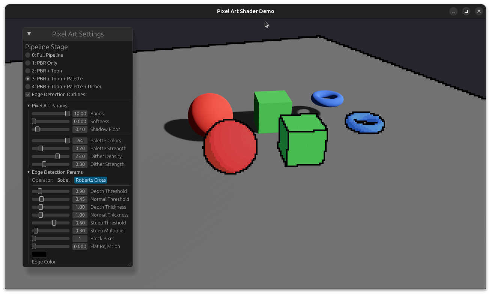

# Bevy Pixel Art Shader

## Overview

A material extension for Bevy that renders 3D models with a pixel art aesthetic. Integrates with Bevy's full PBR lighting pipeline, then post-processes through toon quantization, CIELAB palette matching, and screen-space Bayer dithering. Designed for a low-resolution render-to-texture pipeline with nearest-neighbor upscaling for crisp pixel art output.



## Version compatibility

| Crate version | Bevy version |
| --- | --- |
| 0.1.x | 0.18.x |

## Features

- **Full PBR integration**: Builds on `StandardMaterial` via `MaterialExtension` — all scene lights, shadows, and IBL work out of the box.
- **Toon quantization**: Configurable band count and softness for hard or smooth luminance banding.
- **CIELAB palette matching**: Nearest-neighbor color quantization in perceptually uniform CIELAB space. Ships with a 64-color default palette (PICO-8 32 + DB32-inspired 32).
- **Screen-space Bayer dithering**: 4x4 ordered dither aligned to screen pixels — no surface distortion when objects move.
- **Holdout material**: Invisible occluder (`HoldoutMaterial`) that writes depth but outputs fully transparent color. Use on duplicated geometry in the low-res layer to occlude pixel art entities behind full-res scene geometry.
- **Edge detection compatible**: Prepass writes `alpha=1.0` for pixel art and `alpha=0.0` for holdout, enabling selective outline rendering via [`bevy_edge_detection_outline`](../bevy_edge_detection_outline).
- **Debug stages**: Cycle through pipeline stages (PBR only → +Toon → +Palette → +Dither) to inspect each step.

## Architecture

```
Low-res Camera3d (e.g. 320x180, RenderLayers 1)
  ├── PixelArtMaterial entities (3D models)
  ├── HoldoutMaterial entities (occluders)
  ├── EdgeDetection + DepthPrepass + NormalPrepass
  └── Output: low-res texture with pixel art + outlines

Full-res Camera3d (window resolution, RenderLayers 0)
  ├── Standard PBR entities (terrain, comparison objects)
  └── Output: window framebuffer

UI ImageNode overlay
  └── Nearest-neighbor upscale of low-res texture on top
```

## Usage

```rust
use bevy::prelude::*;
use bevy::camera::RenderTarget;
use bevy::camera::visibility::RenderLayers;
use bevy::image::ImageSampler;
use bevy::render::render_resource::TextureFormat;
use bevy_pixel_art_shader::{
    PixelArtShaderPlugin, PixelArtMaterial, PixelArtExtension,
    PixelArtShaderParams, HoldoutMaterial, HoldoutExtension,
    default_pixel_art_palette,
};
use bevy_edge_detection_outline::{EdgeDetectionPlugin, EdgeDetection};

fn main() {
    App::new()
        .add_plugins(DefaultPlugins)
        .add_plugins(PixelArtShaderPlugin)
        .add_plugins(EdgeDetectionPlugin::default())
        .add_systems(Startup, setup)
        .run();
}

fn setup(
    mut commands: Commands,
    mut meshes: ResMut<Assets<Mesh>>,
    mut pixel_materials: ResMut<Assets<PixelArtMaterial>>,
    mut images: ResMut<Assets<Image>>,
) {
    let (palette, palette_count) = default_pixel_art_palette();

    // Create low-res render target with nearest sampling
    let mut canvas = Image::new_target_texture(320, 180,
        TextureFormat::Rgba8Unorm, Some(TextureFormat::Rgba8UnormSrgb));
    canvas.sampler = ImageSampler::nearest();
    let image_handle = images.add(canvas);

    // Pixel art material
    let mat = pixel_materials.add(bevy::pbr::ExtendedMaterial {
        base: StandardMaterial {
            perceptual_roughness: 1.0,
            reflectance: 0.0,
            ..default()
        },
        extension: PixelArtExtension {
            params: PixelArtShaderParams {
                base_tint: Vec4::new(0.9, 0.15, 0.15, 1.0),
                palette_colors: palette,
                palette_count,
                ..default()
            },
        },
    });

    // Spawn pixel art entity on layer 1
    commands.spawn((
        Mesh3d(meshes.add(Sphere::new(1.0).mesh().ico(5).unwrap())),
        MeshMaterial3d(mat),
        Transform::from_xyz(0.0, 1.0, 0.0),
        RenderLayers::layer(1),
    ));

    // Low-res camera (render-to-texture)
    commands.spawn((
        Camera3d::default(),
        Camera { order: -1, clear_color: Color::srgba(0.0, 0.0, 0.0, 0.0).into(), ..default() },
        RenderTarget::Image(image_handle.clone().into()),
        Msaa::Off,
        Transform::from_xyz(0.0, 3.0, 5.0).looking_at(Vec3::ZERO, Vec3::Y),
        RenderLayers::layer(1),
        EdgeDetection::default(),
    ));

    // Full-res window camera
    commands.spawn((
        Camera3d::default(),
        Transform::from_xyz(0.0, 3.0, 5.0).looking_at(Vec3::ZERO, Vec3::Y),
    ));

    // UI overlay: upscaled low-res texture
    commands.spawn((
        ImageNode::new(image_handle),
        Node {
            width: Val::Percent(100.0),
            height: Val::Percent(100.0),
            position_type: PositionType::Absolute,
            ..default()
        },
    ));

    // Light
    commands.spawn((
        DirectionalLight { illuminance: 8000.0, shadows_enabled: true, ..default() },
        Transform::from_rotation(Quat::from_euler(EulerRot::XYZ, -0.8, 0.5, 0.0)),
        RenderLayers::layer(0).with(1),
    ));
}
```

## Shader Parameters

| Parameter | Default | Description |
| --- | --- | --- |
| `base_tint` | `(1, 1, 1, 1)` | Base tint color (linear RGBA), replaces model's base_color |
| `toon_bands` | `10.0` | Number of toon shading bands |
| `toon_softness` | `0.0` | Softness of band transitions (0 = hard pixel art edges) |
| `toon_shadow_floor` | `0.1` | Minimum brightness in shadow areas |
| `dither_density` | `1.0` | Screen-space dither scale (1.0 = 1 Bayer cell per pixel) |
| `palette_count` | `64` | Number of active palette colors (0 = disable quantization) |
| `palette_strength` | `0.25` | Blend strength toward palette (0 = off, 1 = full) |
| `dither_strength` | `0.3` | Bayer dither strength (0 = off, 1 = full) |
| `debug_stage` | `0` | Pipeline stage to visualize (0=full, 1=PBR, 2=+Toon, 3=+Palette, 4=+Dither) |

## Default Palette

64 colors: PICO-8 base (16) + PICO-8 extended (16) + DB32-inspired extras (32 earth tones, skin, sky, foliage, metal shades). Use `default_pixel_art_palette()` or supply your own `[Vec4; 64]` array.

## Run the example

```bash
cargo run --example demo
```

### Example controls

- **Left-drag**: orbit camera
- **Right-drag**: pan camera
- **Scroll**: zoom
- **EGUI panel**: adjust all shader parameters, toggle edge detection, switch between Sobel/Roberts Cross operators

## Dependencies

```toml
[dependencies]
bevy = { version = "0.18", features = ["3d"] }
bevy_edge_detection_outline = { path = "../bevy_edge_detection_outline" }
```
